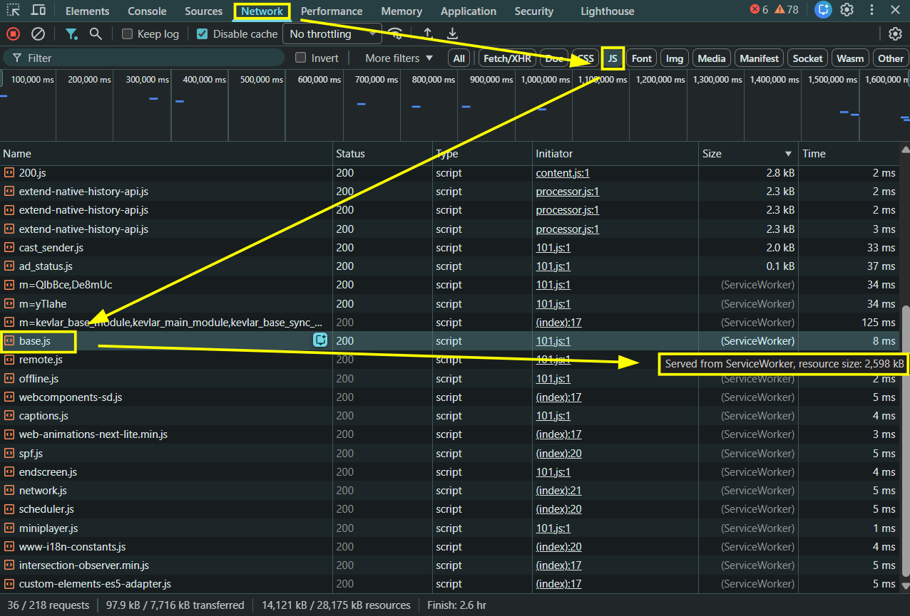

# Actividad 1: Laboratorio de Auditoría y Rendimiento Web

## 1. Auditoría de Red: Análisis Cliente/Servidor (SSR vs. CSR)

Al inspeccionar el tráfico de YouTube con la caché desactivada, filtrando por la pestaña **Doc (HTML)**, se observa que el servidor envía un HTML inicial muy pesado (2,404 kB). 


Sin embargo, su pestaña **Response** demuestra que carece de estructura visual (no hay listado de vídeos, miniaturas ni DOM renderizado). Es simplemente un "cascarón" lleno de datos en crudo dentro de etiquetas `<script>`.


Al cambiar a la pestaña **JS**, se comprueba que el tamaño de los scripts de JavaScript que se descargan supera los 14 MB.


**Conclusión**: Esto demuestra que YouTube utiliza una arquitectura **CSR (Client-Side Rendering)**. El servidor no envía la vista ya renderizada (SSR), sino que delega en el navegador la responsabilidad de descargar, procesar esos datos masivos y construir dinámicamente el árbol DOM mediante JavaScript.

## 2. Destripando el Motor: Compilador JIT y Fases de Rendimiento

Para analizar el motor JS (V8 en Chromium), he realizado una grabación de rendimiento de 5 segundos interactuando con la web.


Al monitorizar la línea de tiempo del hilo principal (*Main Thread*), se aprecian las fases críticas que realiza el motor:
- **Parse HTML**: El navegador construye el árbol DOM.
- **Compile Code**: Acción del **compilador JIT (Just-In-Time)**. Motores como V8 o JavaScriptCore no precompilan el código (AOT), sino que lo traducen en tiempo real de texto plano a lenguaje máquina optimizado sobre la marcha.
- **Evaluate Script**: Es la fase donde el motor ejecuta el código ya compilado para procesar la lógica y dotar de interactividad a la aplicación.

## 3. El Sandbox en acción: Límites de Seguridad

A través de la consola de las DevTools, se comprueba el aislamiento de seguridad que impone el navegador. Si ejecuto una operación básica acotada a la memoria volátil del hilo:

```javascript
const a = "eoo"; console.log(a);
```
El motor procesa e imprime el resultado inmediatamente sin problemas. Sin embargo, al intentar ejecutar un código "maligno" que intenta leer directamente un archivo del disco duro sin intervención del usuario:

```javascript
const r = new FileReader();
r.readAsText("C:/Windows/system.ini");
r.onload = function(){ console.log(r.result); }
```

El motor bloquea la acción arrojando un error de tipo:

```text
VM4904:2 Uncaught TypeError: Failed to execute 'readAsText' on 'FileReader': parameter 1 is not of type 'Blob'.
```


**Conclusión sobre el Sandbox**: Este error evidencia las restricciones del **Sandbox**. Exige consentimiento explícito del usuario y proporciona un aislamiento que impide al código JS realizar llamadas directas al sistema de archivos local (I/O). Esta restricción es vital para la seguridad; sin ella, cualquier web podría explorar el disco duro, exfiltrar datos privados o extraer contraseñas sin permiso.

## 4. Análisis de Bloqueo: Asincronía vs Programación Tradicional

Buscando en la red de YouTube, he localizado un script de infraestructura denominado `base.js` que pesa unos 2,6 MB en memoria.



Si este script masivo se ejecutara mediante un **modelo de programación síncrono y tradicional**, el impacto en la experiencia de usuario sería devastador. Al encontrar el script, el navegador bloquearía la construcción del HTML, congelando por completo el hilo principal esperando su descarga, parseo y compilación. Esto provocaría un *Render Blocking*: el usuario experimentaría una pantalla en blanco y la interfaz quedaría inoperativa.

**Ventajas de la asincronía**: Gracias a la naturaleza asíncrona y orientada a eventos del scripting web moderno, el bloqueo se evita. El archivo se descargan en segundo plano mientras el **Event Loop** (bucle de eventos) divide el procesamiento en tareas más pequeñas. Esto permite al motor alternar la ejecución del código JS masivo con el redibujado de la pantalla, manteniendo la web fluida y totalmente interactiva desde el primer milisegundo.
