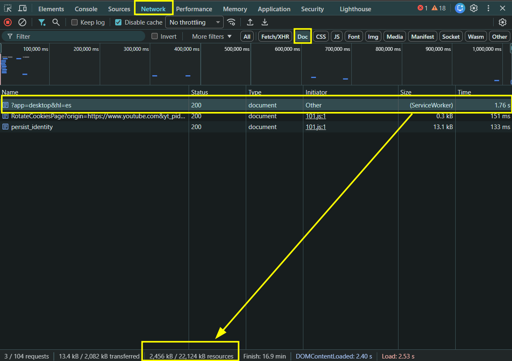
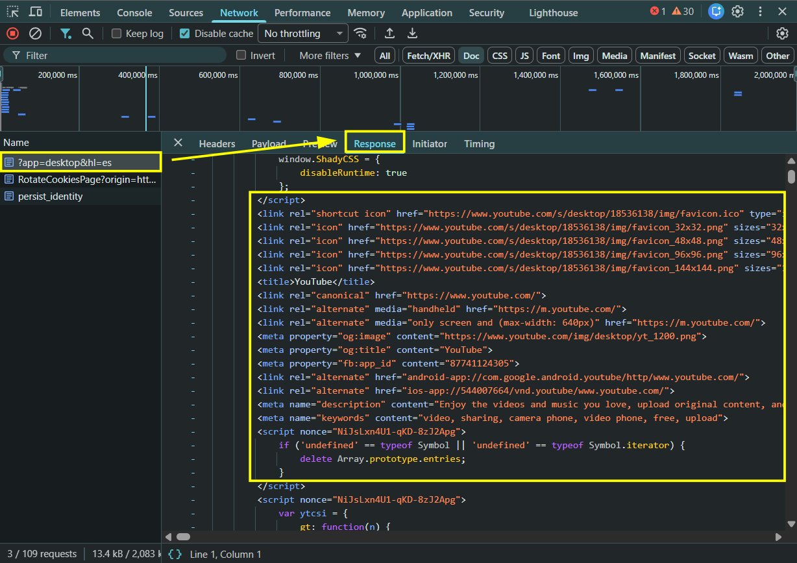
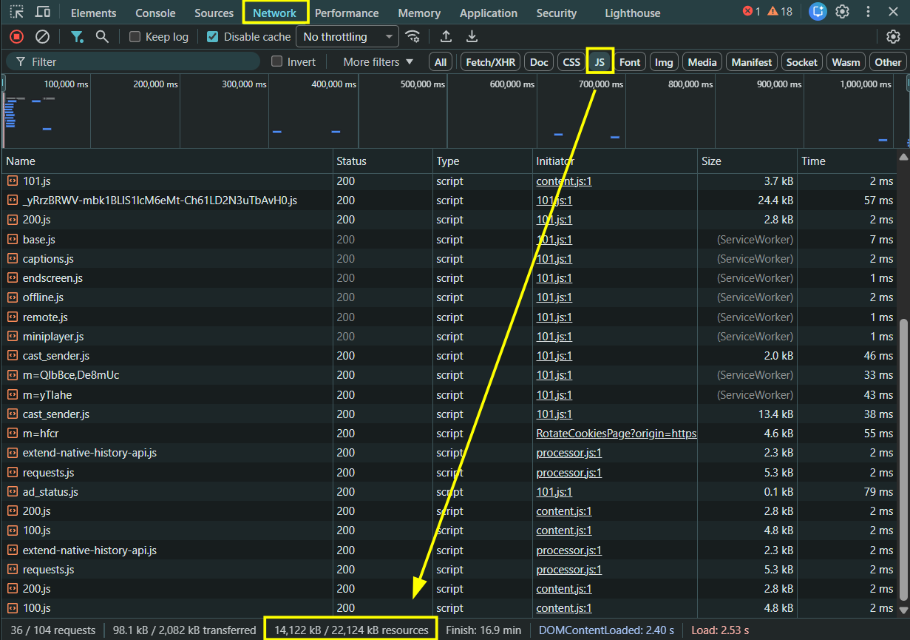
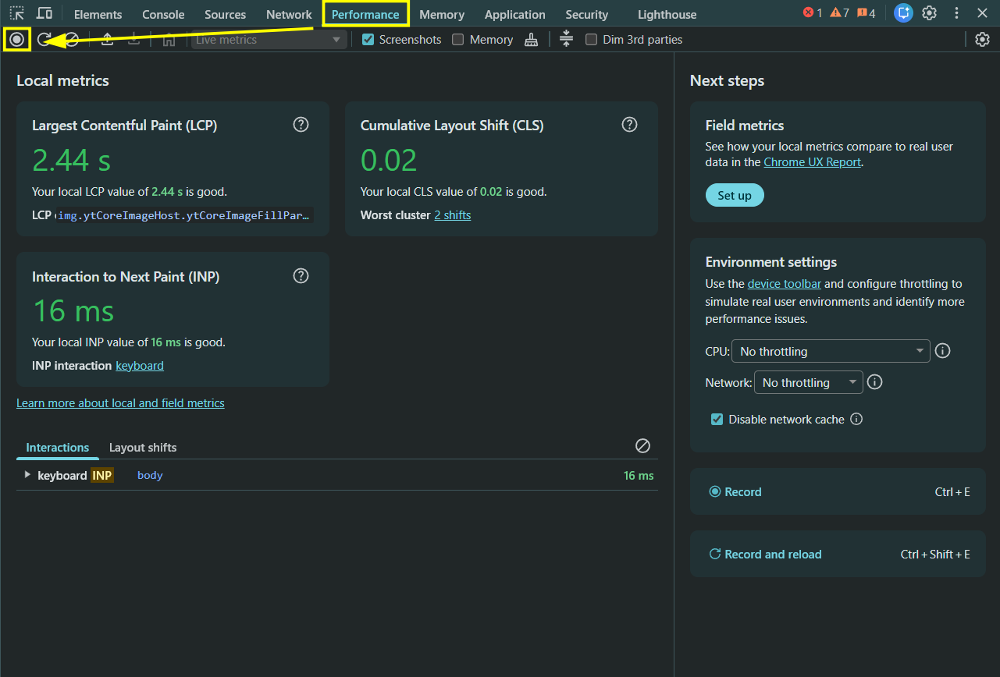
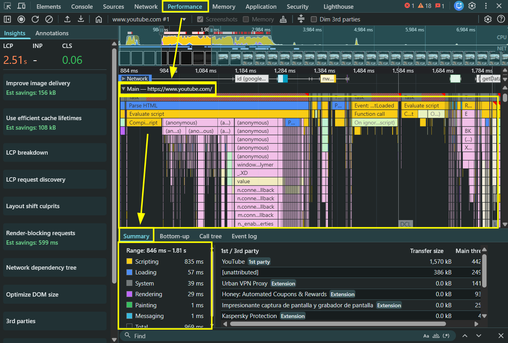
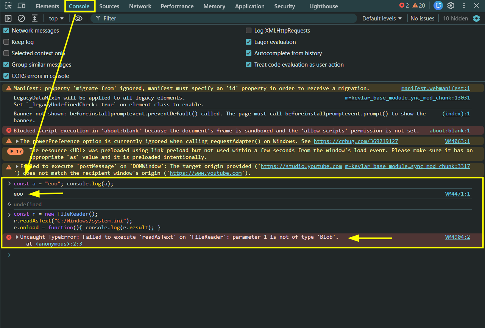

# Actividad 1: Laboratorio de Auditoría y Rendimiento Web

## 1. Auditoría de Red: Análisis Cliente/Servidor

Para esta primera auditoría he analizado la web de YouTube. Utilizando las DevTools del navegador con la caché desactivada, he monitorizado el tráfico inicial para determinar la arquitectura de renderizado de la aplicación.

### Análisis del documento HTML inicial (Doc)

Al filtrar las peticiones por documentos (Doc), detecté que el archivo HTML inicial (`www.youtube.com`) tiene un peso inusualmente grande para ser solo estructura (2,404 kB).



Sin embargo, al inspeccionar la pestaña **Response** (Respuesta) de este archivo, comprobé que este peso no corresponde a una página web maquetada y lista para mostrar. El archivo carece del DOM visual final (no hay listado de vídeos, miniaturas ni barra lateral). En su lugar, el servidor envía un "cascarón" básico que contiene masivos bloques de datos en crudo dentro de etiquetas `<script>`.



### Análisis de la carga de JavaScript (JS)

A esto se le suma una carga gigantesca de código en el cliente. Al cambiar el filtro a la pestaña **JS**, la barra de estado de las DevTools revela un dato clave:



El tamaño real de los recursos JavaScript que el navegador debe descomprimir y procesar asciende a 14,122 kB (unos 14.1 MB), lo que supone la gran mayoría del peso total de la página (21.9 MB).

### Conclusión del Modelo (SSR vs CSR)

Basándome en la respuesta vacía de estructura visual del primer HTML y en la descomunal carga de más de 14 MB de código JS, se evidencia que YouTube utiliza un modelo **CSR (Client-Side Rendering)**. El servidor no envía la vista pre-renderizada; sino que delega la responsabilidad en el cliente. Es el navegador el que debe procesar los datos iniciales y ejecutar el motor JavaScript para generar dinámicamente el árbol DOM y pintar la interfaz completa en la pantalla.

## 2. Destripando el Motor: Análisis de Rendimiento

Continuando con la auditoría técnica sobre YouTube, he utilizado la pestaña Performance (Rendimiento) de las DevTools para analizar el comportamiento del hilo principal (Main thread) y la carga computacional que soporta el navegador durante la interacción con la plataforma.

### Metodología y perfilado en DevTools

Para capturar la actividad del motor JavaScript, accedí a la pestaña Performance para configurar el entorno de pruebas antes de iniciar la monitorización.



Inicié la grabación en el panel Performance (botón Record o Ctrl + E) y realicé interacciones continuas sobre la página de YouTube (desplazamiento vertical o scroll y exploración de elementos) durante un intervalo de 5 segundos. Tras detener la grabación, el navegador procesó el perfil generando el mapa completo de rendimiento en el hilo principal.



### Fases de ejecución del motor JavaScript

Al inspeccionar las barras de la línea de tiempo en la sección Main, he localizado los eventos clave que ejecuta el motor de JavaScript para procesar la página:

- **Parse HTML (Azul)**: El navegador analiza la estructura del documento HTML y construye el árbol DOM. Al tratarse de una SPA altamente dinámica como YouTube, este proceso se intercala constantemente con la ejecución de código.
- **Compile Code (Amarillo)**: Muestra el trabajo del Compilador JIT (Just-In-Time). JavaScript no utiliza una compilación previa (Ahead-Of-Time). En su lugar, el motor toma el código fuente en texto plano descargado de la red y lo traduce a código máquina optimizado en tiempo real justo antes de ser ejecutado.
- **Evaluate Script (Amarillo)**: Es la fase en la que el motor ejecuta las instrucciones máquina ya compiladas, encargándose de procesar la lógica de la aplicación, gestionar los eventos de interacción y renderizar los nuevos elementos visuales.

### Comparativa de motores de navegador

Dado que he realizado esta prueba en un navegador basado en Chromium (como Google Chrome o Microsoft Edge), el motor encargado de este proceso es V8. Sin embargo, la gestión interna varía según el entorno de ejecución:

- **V8 (Google Chrome / Edge)**: Utiliza un sistema JIT de varias etapas (intérprete Ignition + compilador optimizador TurboFan) para lograr una compilación rápida y eficiente.
- **JavaScriptCore / Nitro (Safari)**: Es el motor desarrollado por Apple para entornos WebKit, optimizado para minimizar el consumo energético en dispositivos macOS e iOS.
- **SpiderMonkey (Mozilla Firefox)**: El motor histórico de Mozilla, dotado de su propia arquitectura de compilación JIT multinivel (WarpMonkey).

A pesar de las diferencias de arquitectura entre V8, JavaScriptCore y SpiderMonkey, todos ellos comparten la necesidad de aplicar compilación JIT para procesar la enorme carga de scripts que requiere una web CSR como YouTube.

## 3. El Sandbox en acción: Límites de Seguridad

En esta tercera prueba he analizado las restricciones de ejecución de scripts y el aislamiento de seguridad que impone el navegador, utilizando para ello la pestaña Console (Consola) de las DevTools sobre la página de YouTube.

### Ejecución de código en memoria vs. Intento de acceso al disco duro

En primer lugar, ejecuté una instrucción inofensiva de declaración de variable e impresión en memoria:

```javascript
const a = "eoo"; console.log(a);
```

El motor procesó la instrucción inmediatamente imprimiendo el resultado "eoo", ya que se trata de una operación básica acotada únicamente a la memoria volátil del hilo de ejecución.

A continuación, simulé una acción maliciosa intentando instanciar la API FileReader para leer directamente un archivo sensible del sistema operativo (C:/Windows/system.ini) pasando la ruta como texto plano:

```javascript
const r = new FileReader();
r.readAsText("C:/Windows/system.ini");
r.onload = function(){ console.log(r.result); }
```



### Análisis del error y limitaciones del Sandbox

Al ejecutar el script de lectura, el motor bloqueó la acción de inmediato lanzando el error de tipo:

```text
VM4904:2 Uncaught TypeError: Failed to execute 'readAsText' on 'FileReader': parameter 1 is not of type 'Blob'.
```

Este comportamiento evidencia el funcionamiento del Sandbox (caja de arena) del navegador y sus mecanismos de protección:

- **Consentimiento explícito del usuario**: La API FileReader no acepta rutas absolutas en texto plano por motivos de seguridad. Exige obligatoriamente un objeto de tipo Blob o File, el cual únicamente se puede obtener si el usuario selecciona de forma explícita y voluntaria un archivo a través de un componente `<input type="file">` o arrastrándolo a la página.
- **Aislamiento de recursos (I/O del sistema)**: El Sandbox impide que el código JavaScript ejecutado dentro de la pestaña del navegador pueda realizar llamadas directas al sistema de archivos local o acceder a la memoria del sistema operativo.

### Importancia vital del Sandbox para el usuario

El Sandbox es el pilar fundamental de la seguridad en la web moderna. Si esta barrera de aislamiento no existiera, cualquier sitio web que visitáramos (como YouTube o cualquier página de terceros) podría ejecutar scripts en segundo plano para explorar nuestro disco duro, exfiltrar datos personales, leer claves privadas, extraer contraseñas guardadas o infectar el sistema operativo sin interacción ni permiso previo del usuario.
