# Informe de Resultados: Análisis Empírico de Integración de Scripts ("Duelo de la Integración")

Este informe documenta el impacto en el rendimiento, el orden de ejecución y la disponibilidad del DOM al utilizar cinco estrategias distintas de integración de JavaScript (Escenarios A–E) en un entorno local (http://localhost). Las mediciones se han realizado mediante las herramientas de desarrollo Google Chrome DevTools (pestañas Console, Network y Performance).

## 1. Escenario A: `<script>` Síncrono en el `<head>`

### Evidencia Visual
* **Captura 1.1 - Consola:** 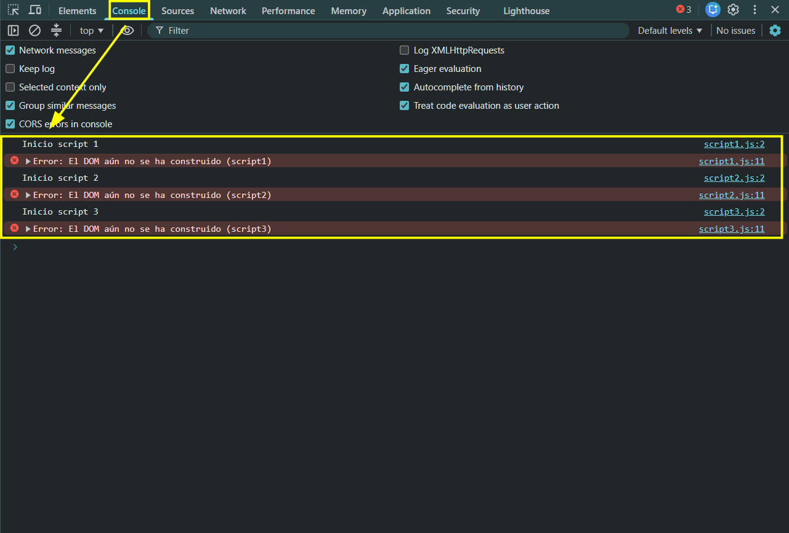 Muestra el mensaje Error: El DOM aún no se ha construido en los tres scripts.
* **Captura 1.2 - Network (Filtro Doc):** 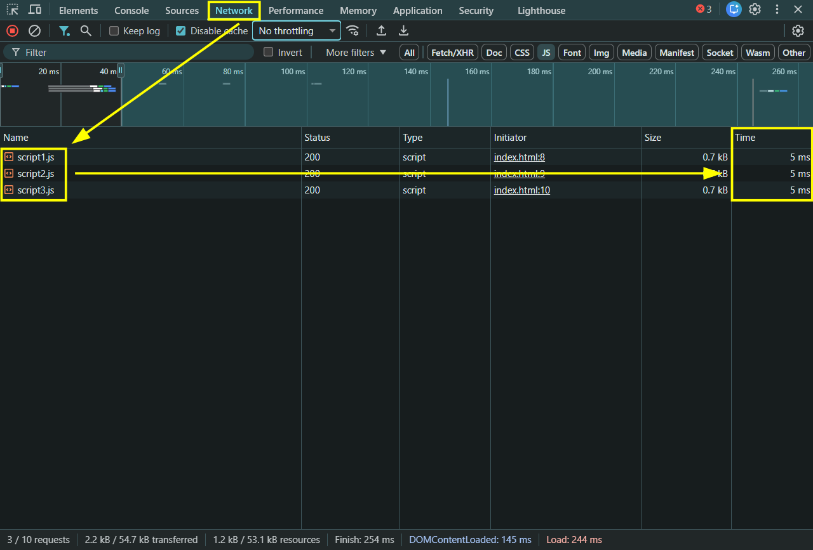 Descarga del documento index.html.
* **Captura 1.3 - Network (Filtro JS):** 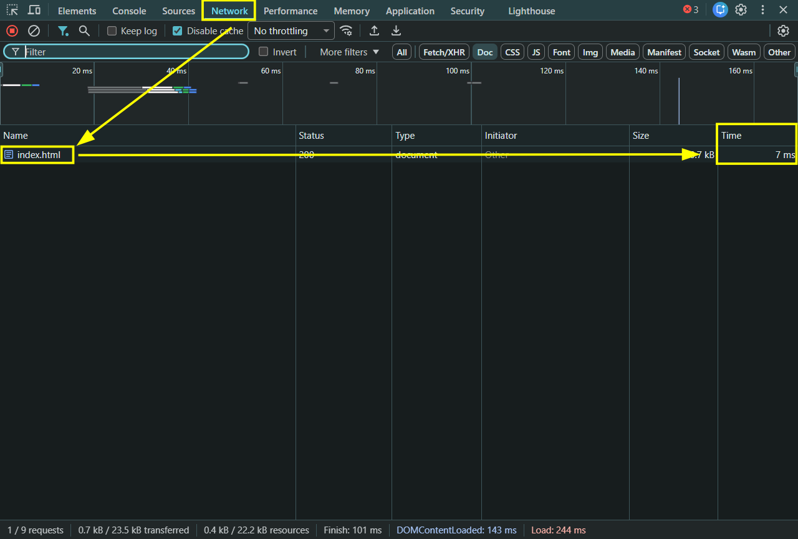 Solicitud secuencial y bloqueante de script1.js, script2.js y script3.js.
* **Captura 1.4 - Performance:** 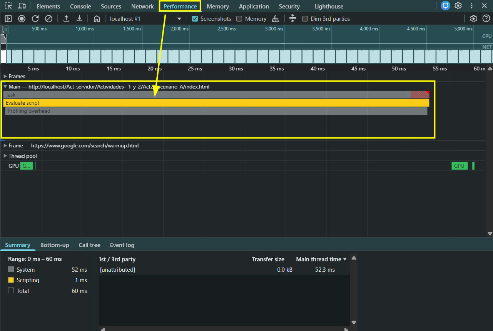 Bloque Evaluate Script amarillo de larga duración situado antes de la marca de First Paint (FP).

### Análisis Técnico
Al ubicar los scripts síncronos dentro del `<head>`, el navegador interrumpe la construcción del árbol DOM para descargar y ejecutar cada archivo.
* **Disponibilidad del DOM:** Falla. Los scripts se ejecutan cuando el objeto `document.getElementById('titulo')` aún no ha sido parseado, arrojando un error de referencia nula.
* **Impacto en Rendimiento:** Severo. La tarea pesada de JavaScript (Evaluate Script) bloquea el hilo principal (Main Thread), desplazando el evento First Paint (FP) hacia la derecha. El usuario percibe una pantalla en blanco (Flash of Unstyled Content / congelamiento) durante toda la ejecución de los bucles.

## 2. Escenario B: `<script>` Síncrono al final del `<body>`

### Evidencia Visual
* **Captura 2.1 - Consola:** 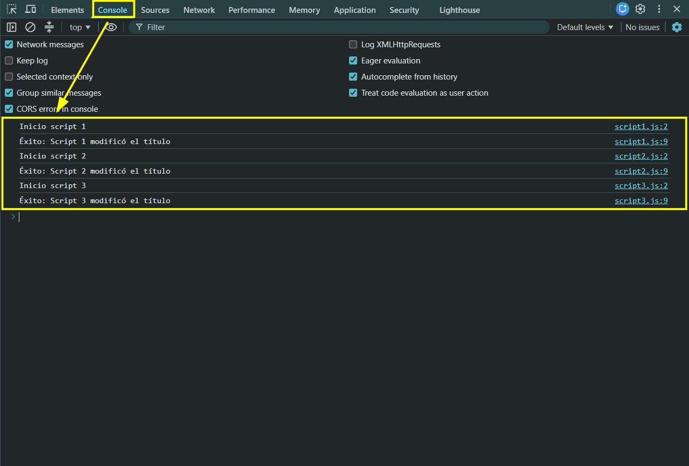 Registros de Inicio y Éxito secuenciales (1 -> 2 -> 3). Texto final del DOM: "Cambiado por Script 3".
* **Captura 2.2 - Network (Filtro Doc):**  Carga completa del HTML previa a la descarga de scripts.
* **Captura 2.3 - Network (Filtro JS):** 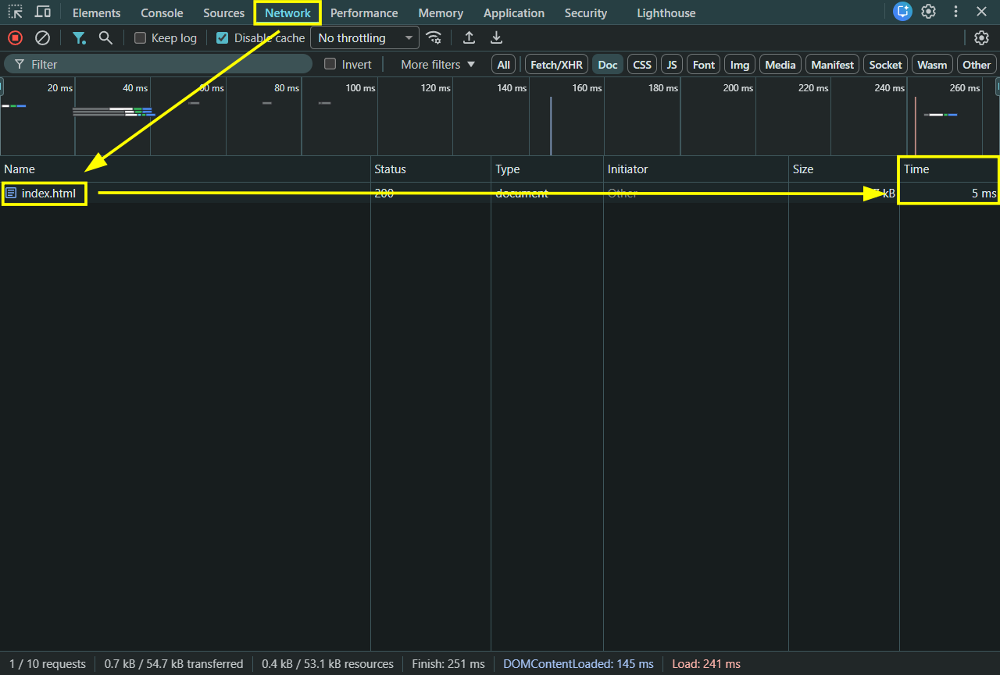 Solicitud de scripts iniciada únicamente tras completar el parseo del cuerpo del documento.
* **Captura 2.4 - Performance:** 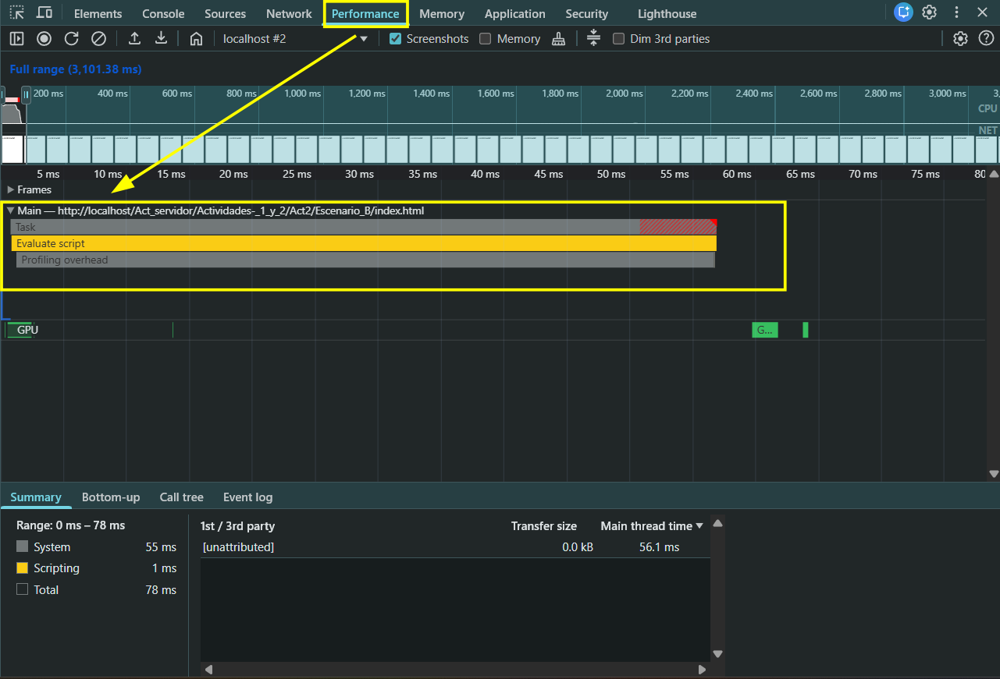 La marca First Paint ocurre tempranamente, seguida de la ejecución del bloque de scripts.

### Análisis Técnico
Colocar las etiquetas `<script>` justo antes del cierre de `</body>` garantiza que el navegador parsee todo el HTML antes de procesar el código JavaScript.
* **Disponibilidad del DOM:** Exitosa. El elemento `<h1>` se encuentra en memoria, permitiendo que cada script modifique el nodo en orden estricto.
* **Impacto en Rendimiento:** Aceptable para la renderización visual inicial. El First Paint se dispara rápido (mostrando el valor original "Hola"), aunque las tareas pesadas de JS bloquean la interactividad posterior del documento hasta que finalizan los tres bucles.

## 3. Escenario C: `<script async>` en el `<head>`

### Evidencia Visual
* **Captura 3.1 - Consola:** 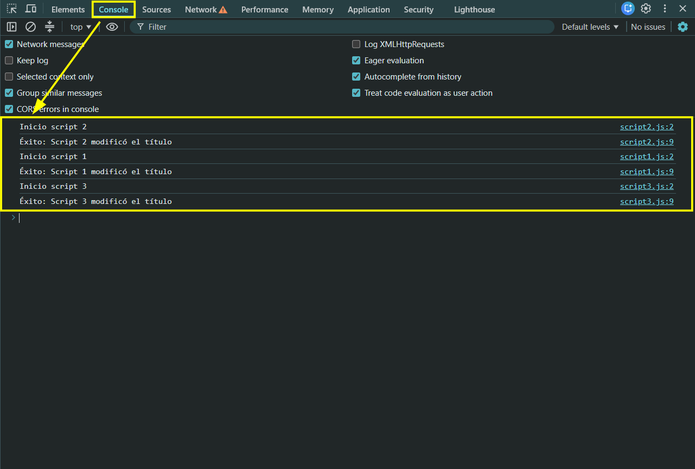 Ejecución asíncrona. Muestra alteración en el orden de los logs o resoluciones de DOM condicionadas por el tiempo de descarga.
* **Captura 3.2 - Network (Filtro Doc):** 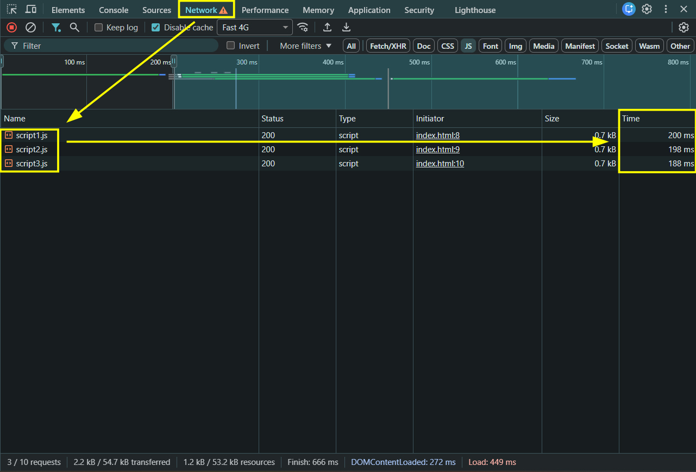 Parseo del documento base.
* **Captura 3.3 - Network (Filtro JS):** 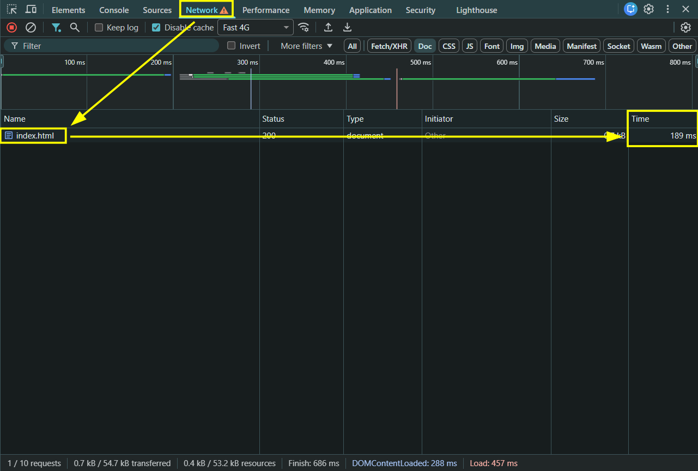 Solicitudes HTTP de los tres archivos enviadas en paralelo.
* **Captura 3.4 - Performance:** 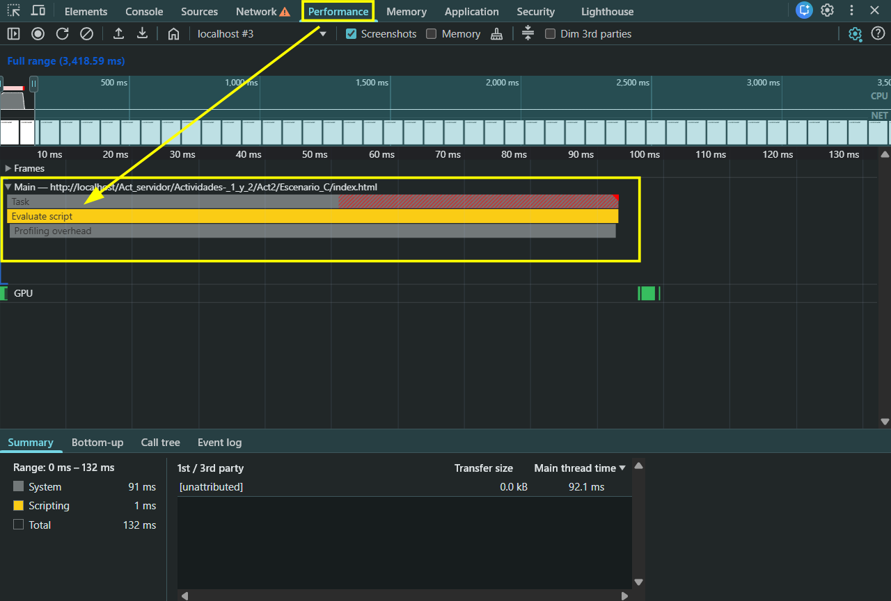 Tareas Evaluate Script incrustadas de forma intermitente interrumpiendo el flujo de Parse HTML.

### Análisis Técnico
El atributo `async` descarga los scripts en segundo plano sin pausar la lectura del HTML. Sin embargo, ejecuta cada archivo en el instante preciso en que finaliza su descarga, pausando el parseo del DOM.
* **Disponibilidad del DOM:** Falla / Inestable. Si el script termina de descargarse antes de que el navegador llegue al nodo `<h1>`, la ejecución falla. Además, el orden de ejecución no está garantizado (no determinista).
* **Impacto en Rendimiento:** Mejora el tiempo de descarga en red al paralelizar solicitudes, pero introduce cierres intempestivos del hilo principal durante la lectura del HTML, desvinculándose por completo del evento DOMContentLoaded.

## 4. Escenario D: `<script defer>` en el `<head>`

### Evidencia Visual
* **Captura 4.1 - Consola:** 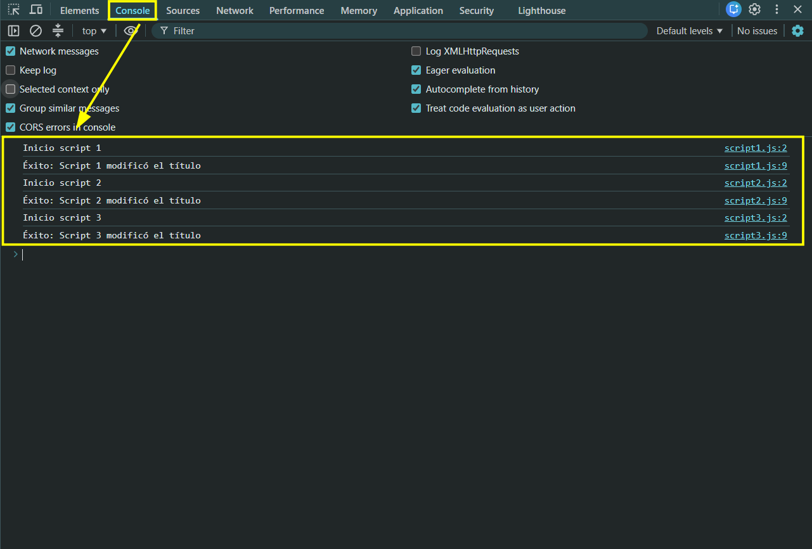 Salida limpia y ordenada (1 -> 2 -> 3) con mensajes de éxito. Resultado en pantalla: "Cambiado por Script 3".
* **Captura 4.2 - Network (Filtro Doc):** 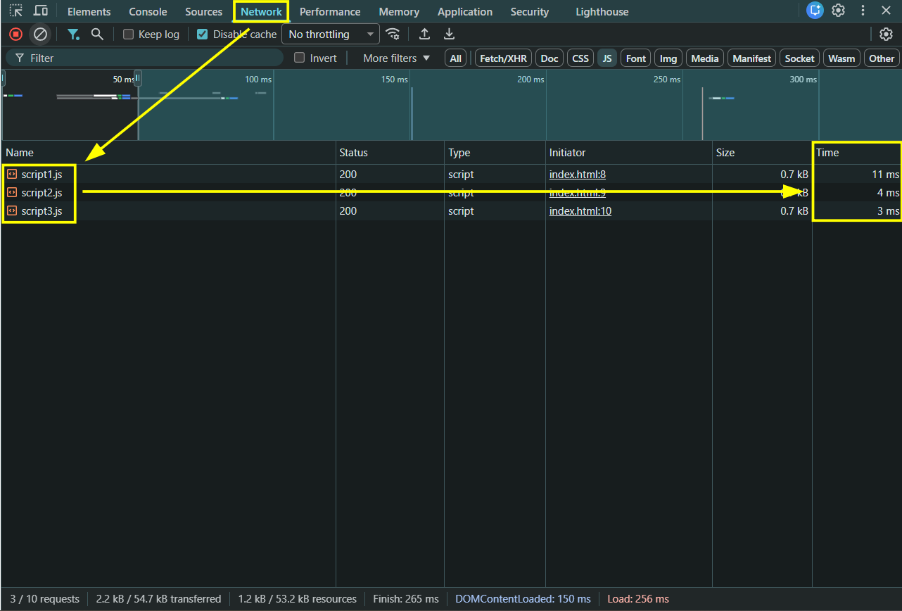 Petición del HTML inicial.
* **Captura 4.3 - Network (Filtro JS):** 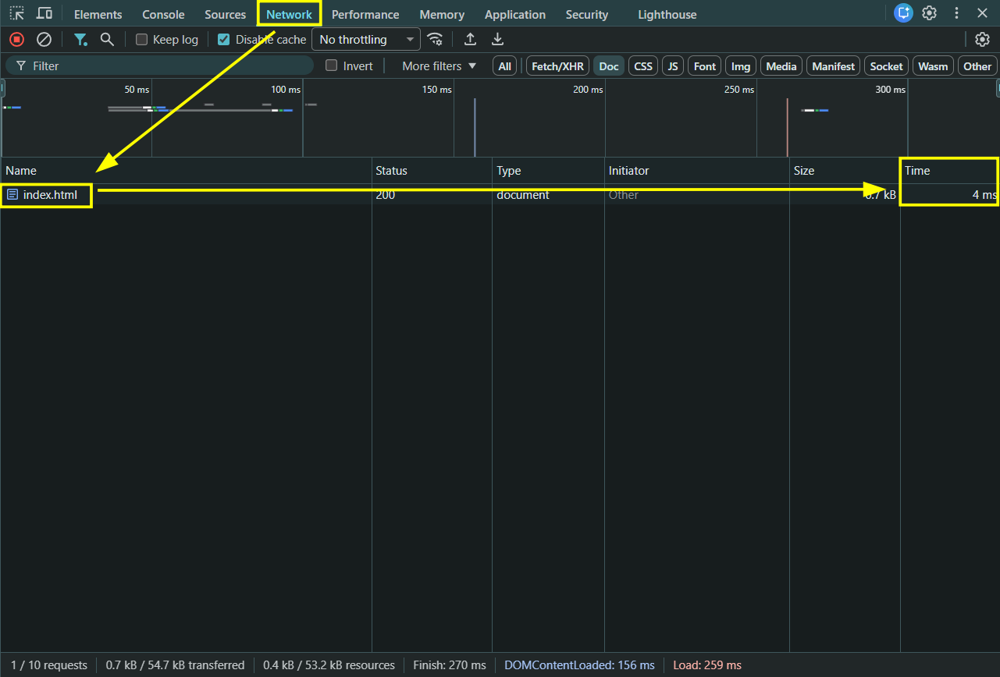 Descarga paralela e inmediata de los tres scripts en segundo plano.
* **Captura 4.4 - Performance:**  First Paint inmediato; bloques Evaluate Script ejecutados en secuencia justo antes de la línea de DOMContentLoaded (DCL).

### Análisis Técnico
El atributo `defer` combina la descarga asíncrona (en paralelo) con la ejecución diferida.
* **Disponibilidad del DOM:** Exitosa y garantizada. Los scripts esperan obligatoriamente a que el HTML finalice su estructuración en el árbol DOM.
* **Impacto en Rendimiento:** Óptimo. No se bloquea el hilo principal durante la lectura del documento, el First Paint ocurre de manera casi instantánea y la ejecución mantiene el orden secuencial definido en el marcado HTML.

## 5. Escenario E: `<script type="module">` en el `<head>` (ES6 Modules)

### Evidencia Visual
* **Captura 5.1 - Consola:** 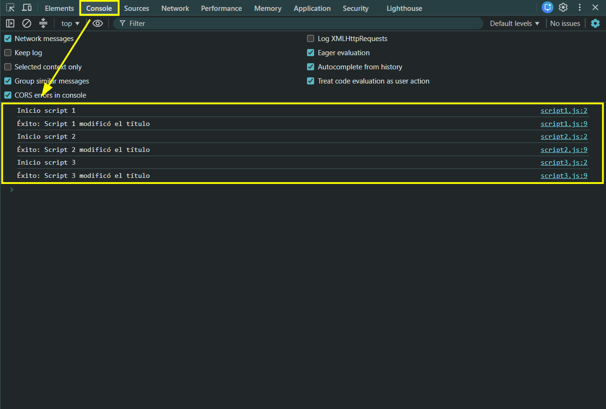 Ejecución correcta y ordenada (1 -> 2 -> 3) idéntica a defer, sin colisiones de variables globales.
* **Captura 5.2 - Network (Filtro Doc):** 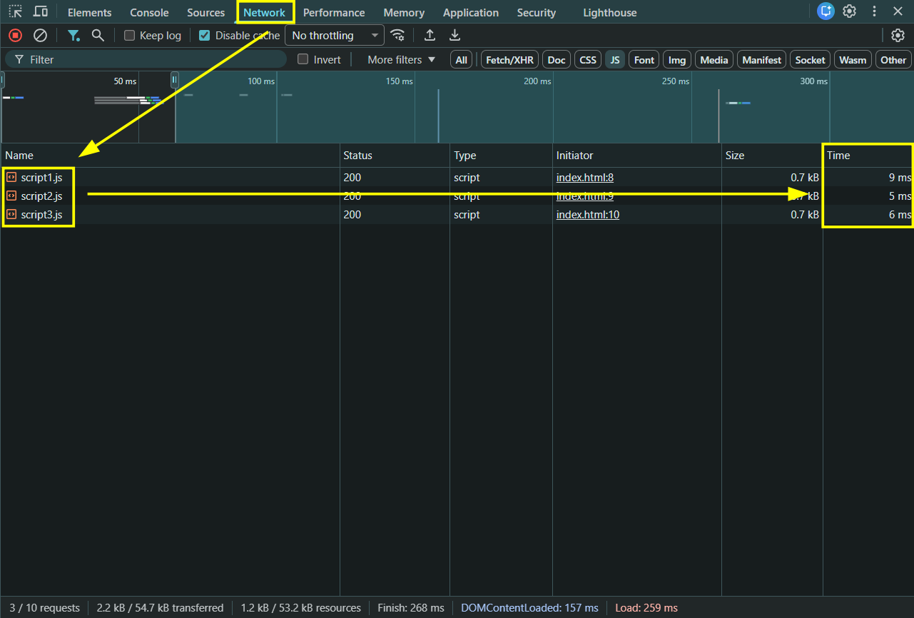 Carga del documento a través del protocolo http://localhost.
* **Captura 5.3 - Network (Filtro JS):** 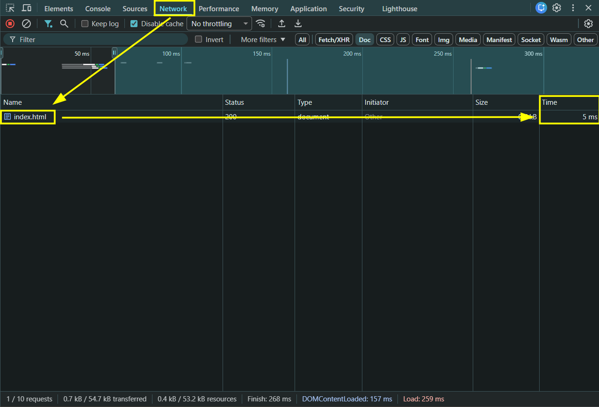 Solicitud HTTP de módulos ES6 bajo la política CORS del servidor.
* **Captura 5.4 - Performance:** 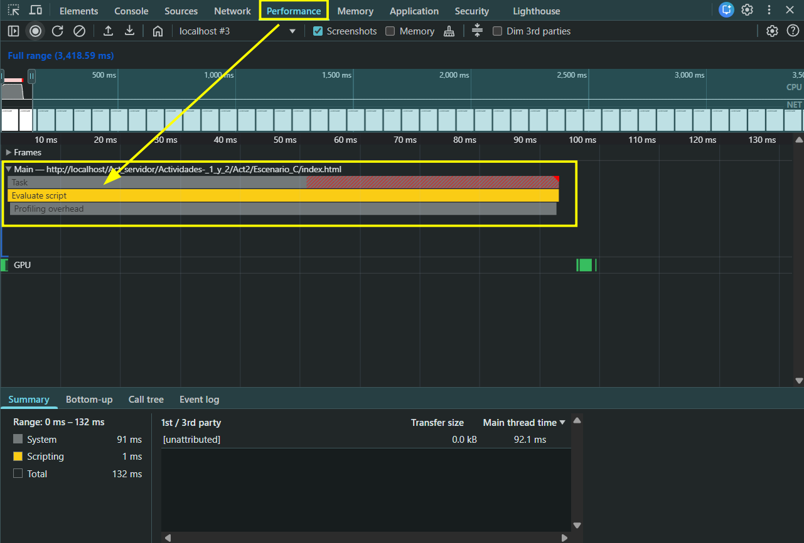 Marcador First Paint rápido con ejecución diferida ordenada antes de DOMContentLoaded.

### Análisis Técnico y Comportamiento de Módulos ES6
Los módulos JavaScript (`type="module"`) adoptan un comportamiento diferido (`defer`) por defecto, pero introducen diferencias arquitectónicas fundamentales frente al JavaScript tradicional:
* **Aislamiento de Ámbito (Module Scope):** En los Escenarios A–D, el código comparte el ámbito global (window). En el Escenario E, cada archivo crea su propio ámbito cerrado. Esto evita que la declaración `const titulo` entre en conflicto entre archivos sin necesidad de renombrar variables a titulo1 o titulo2.
* **Requisito de Origen Seguro (CORS / Servidor HTTP):** A diferencia de los scripts tradicionales que pueden ejecutarse mediante el protocolo `file://`, los módulos requieren un servidor web (http://localhost en XAMPP) para ser procesados debido a las restricciones de seguridad del motor de JavaScript.
* **Modo Estricto Implícito:** Se ejecutan automáticamente bajo `"use strict"`, impidiendo asignaciones accidentales al objeto global.

## 6. Cuadro Comparativo de Resultados

| Escenario | Estrategia de Carga | Acceso al DOM | Orden Garantizado | Impacto en First Paint (FP) | Ámbito de Ejecución |
| :--- | :--- | :--- | :--- | :--- | :--- |
| A | `<script>` en `<head>` | Falla | Sí (1 -> 2 -> 3) | Severo (Pantalla en blanco) | Global (window) |
| B | `<script>` en `<body>` | Éxito | Sí (1 -> 2 -> 3) | Mínimo (Muestra HTML base) | Global (window) |
| C | `<script async>` | Falla / Inestable | No determinista | Medio (Descarga paralela, interrumpe parseo) | Global (window) |
| D | `<script defer>` | Éxito | Sí (1 -> 2 -> 3) | Óptimo (Descarga paralela, ejecuta post-DOM) | Global (window) |
| E | `<script type="module">` | Éxito | Sí (1 -> 2 -> 3) | Óptimo (Diferido implícito) | Módulo local (Aislado) |
